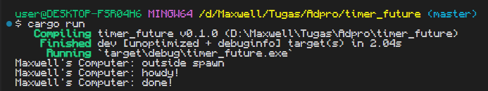
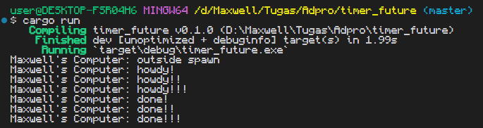
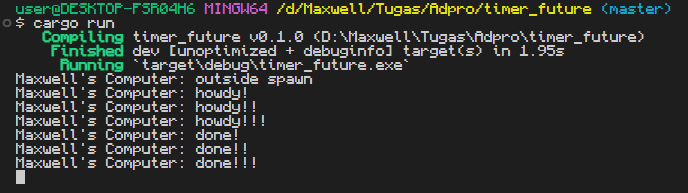

# Module 10 - Timer

Dari gambar di atas, dapat dilihat bahwa pesan `Maxwell's Computer: outside spawn` merupakan pesan yang paling pertama di print yang kemudian diikuti oleh pesan `Maxwell's Computer: howdy!` dan setelah 2 detik berlalu, `Maxwell's Computer: done!`. Hal ini disebabkan karena pesan `howdy!` dan `done!` merupakan sebuah `future` yang baru akan dijalankan ketika `executor` berjalan. Karena perintah print untuk message `outside spawn` berada tepat setelah bagian `spawner.spawn(...)` dan sebelum `executor.run()`, perintah print `outside spawn` tersebut akan dijalankan terlebih dahulu sebelum perintah print `howdy!` dan `done!`.

Pada gambar di atas, saya melakukan 3 spawn yang perbedaannya ditandakan oleh banyaknya tanda seru. Dari apa yang saya lihat, yang terjadi adalah ketiga `future` tersebut dijalankan dalam waktu yang *hampir* bersamaan, dengan hasil spawn pertama dijalankan pertama, spawn kedua dijalankan kedua, dan spawn ketiga dijalankan ketiga. Namun, berbeda dari metode *synchronous programming* yang mengharuskan kita menunggu suatu *task* untuk selesai dijalankan baru kita dapat menjalankan *task* berikutnya, dalam kasus ini ketiga *task* langsung dijalankan dan mereka juga berakhir dalam waktu yang *hampir* sama. Tidak ada tunggu menunggu seperti pada *synchronous programming*.

Pada gambar di atas, saya menghilangkan statement `drop(spawner)`. Hal ini menyebabkan program tidak berhenti setelah selesai menjalankan ketiga *task* sebelumnya karena program masih mengira akan ada *task* baru lagi dari `spawner`. Sehingga, ketika kita melakukan `drop(spawner)`, itu seperti mengatakan bahwa semua *task* yang ingin dilakukan sudah di *spawn* dan tidak akan ada lagi *task* baru setelah poin ini, dan program dapat berhenti setelah menyelesaikan semua *task* yang telah di *spawn*.
